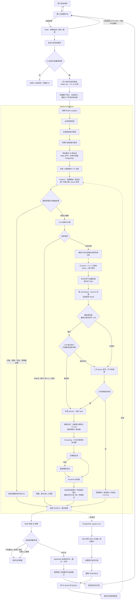

# 把 AI 客服拆成一条可追踪的生产线：从消息接入、RAG 到人工接管与质量回流

## 一、我最终理解的不是一条 Prompt，而是一套运行时系统

最开始我容易把 AI 客服理解成“用户提问 → 大模型回答”。把整条链路逐层拆开后，我才真正建立起一个稳定的认知：

- **Runtime 管流程**：决定本轮能不能继续、走哪个分支、什么时候重试、什么时候澄清、什么时候转人工、生成结果还有没有发送资格。
- **知识库管事实**：保存可被检索的业务事实、操作步骤、适用产品端和来源信息。
- **LLM 管语义和表达**：理解自然语言、补全省略语义、改写检索词、判断片段是否能回答问题，并在证据约束下组织最终答复。

这三个部分不能互相替代。只有 LLM，没有 Runtime，系统会失去边界；只有 Runtime，没有知识库，系统没有稳定事实；只有知识库，没有语义理解，用户一句“入口在哪”就很难独立命中正确内容。

当前系统可以拆成三个服务层和四类数据设施：

| 层级 | 主要职责 | 不应该承担的职责 |
|---|---|---|
| 第三方客服平台 | 接收用户消息、回调消息、投递文本/图片/文件 | 不负责 RAG 决策 |
| Node 中间层 | 验签解密、异步分发、客户与接管状态、调用 AI、发送前复查、消息格式转换 | 不负责凭经验生成业务答案 |
| Mastra AI 服务 | 鉴权限流、会话恢复、Prepare / Retrieve / Generate 工作流、模型降级、过程埋点 | 不直接假设第三方客服平台的发送协议 |
| PostgreSQL | 持久化会话记忆、线程、运行分析数据及 Node 侧业务记录 | 不承担低延迟临时状态 |
| Redis | 最近会话缓存、限流计数、Node 侧并发消息组 | 不作为唯一长期事实来源 |
| Qdrant | 向量、可回答正文和 Metadata | 不保存客户会话状态 |
| LLM / Embedding / Rerank | 语义分类、向量化、相关性排序、受控生成 | 不拥有业务状态迁移权 |

## 二、全链路总图

下面这张图把一条用户消息从回调到最终投递的主干、短路、恢复和质量回流画在一起。

图很大，但主线其实只有一句话：**技术接收成功之后，Runtime 还要完成资格判断、语义理解、证据检索、受控生成和发送前复查，最后一次外部接口调用也不等于用户已经成功收到消息。**

## 三、消息接入：为什么回调先返回 200，再处理业务

第三方客服平台是这条链路的“上游”。它把用户消息加密后回调给 Node。Node 先做基础参数检查、签名验证和内容解密，然后把事件交给异步事件中心，HTTP 请求立即返回 200。

这里的 200 只有一个含义：**Node 已经收到这次回调，第三方客服平台无需重复推送。**

它不能证明以下任意一件事：

- AI 服务已经成功处理；
- 知识检索已经命中；
- 生成模型已经返回；
- 当前答案仍有发送资格；
- 第三方客服平台已经把消息送到用户端。

这样设计的直接原因是防止上游把耗时的 AI 处理当成回调失败。如果 Node 等到整条 RAG 链路结束才响应，一旦超时，上游可能重试同一条回调，反而制造重复请求和重复发送。

当前实现即使验签失败或内部处理异常，也会记录日志并返回 200。这保证了回调入口稳定，但也意味着后续故障恢复必须依赖内部日志、幂等和监控，不能依赖上游自动重试。

## 四、Node 中间层：不负责“聪明”，负责把边界守住

Node 层最重要的价值不是转发 HTTP，而是把第三方客服平台的消息生命周期和 AI Runtime 接起来。

### 4.1 接管资格

每个客户都有一个“AI 是否启用”的业务状态。收到消息后，Node 会读取该状态：

- AI 已关闭：不调用 AI，消息按人工侧流程记录；
- AI 已开启：进入自动回复链路；
- AI 生成过程中如果发生人工接管：发送前再次读取状态，已经失去资格的答案直接丢弃。

所以“AI 已经生成答案”和“AI 有资格发送答案”是两件不同的事。

### 4.2 并发消息组与最后一问原则

同一用户可能连续发送 A、B 两条消息，而 A 的 AI 请求尚未结束。当前 Node 使用 Redis List 记录本轮待处理消息组，TTL 为 10 分钟。多个请求可以并发执行，但真正发送前会检查：当前事件是否仍是列表中的最后一条。

例如：

1. 用户发送 A：“入口在哪里？”
2. A 开始检索和生成。
3. 用户紧接着发送 B：“我找到了，是另一个问题。”
4. B 成为 Redis List 最后一条消息。
5. A 即使生成成功，发送前也会因为自己已经过时而被丢弃。

这不是取消了 A 的计算，而是通过**发送时一致性校验**阻止过时结果影响用户。当前策略允许并发，但只允许当下仍合法的答案离开系统。

### 4.3 Node 传给 AI 的最小上下文

Node 调用 AI 服务时传入的核心字段包括：

| 字段 | 作用 |
|---|---|
| customerId | 客户维度限流、资源归属和分析 |
| threadId | 会话记忆与临时状态的索引；当前接入中通常与客户标识一致 |
| message | 聚合后的本轮用户文本 |
| role | 调用侧已知的产品与终端上下文；后文会解释这个名字容易误导 |

对于接入第三方客服平台的渠道，Node 会从客户所属渠道推导初始产品端上下文，再交给 Mastra 继续纠偏。它不是把最近 20 条聊天全文都从 Node 传过去；会话记忆由 Mastra 自己从 Redis / PostgreSQL 恢复。

## 五、会话记忆与 5 类 TTL 状态

### 5.1 最近 20 条会话

Mastra 使用 PostgreSQL 作为持久化记忆，Memory 配置保留最近 20 条消息；Redis 在其上实现 Cache-Aside：

1. 先按 threadId 读取 Redis；
2. 命中则直接返回；
3. 未命中或 Redis 不可用则从 PostgreSQL 读取；
4. 按时间排序，同一毫秒内强制 user 在 assistant 之前；
5. 截取最后 20 条并回写 Redis，缓存 TTL 为 24 小时。

因此 Redis 断开不会让长期会话事实消失，只会让读取变慢；PostgreSQL 才是持久化底座。

### 5.2 5 类状态并不都是“挂起问题”

当前工作流还有 5 个进程内 TtlMap。把它们统称为“5 类挂起状态”容易误解，更准确的叫法是“5 类会话辅助状态”：

| 状态 | 保存内容 | TTL | 何时写入 | 何时消费 |
|---|---|---:|---|---|
| 待产品范围确认 | 原始问题 | 7 天 | 问题像业务问题，但还无法确定产品范围 | 用户下一轮只回复产品名时，恢复原问题继续处理 |
| 待人工确认 | `true` | 1 小时 | 首次识别到转人工意图 | 用户明确确认后，返回转人工触发结果 |
| 最近有效检索范围 | 产品 + 终端对应的上下文字符串 | 7 天 | 本轮确定了有效范围 | 下一轮没有产品词时沿用 |
| 待澄清问题 | 原始问题 | 1 小时 | 二次检索仍不足，系统发出澄清 | 用户确认后恢复原问题，或用新补充覆盖旧问题 |
| 连续兜底次数 | 数字计数 | 7 天 | 连续弱检索 / 澄清 | 达到第 3 次时追加人工入口；正常命中后清零 |

它们由 Runtime 的 Node.js 代码维护，不由 LLM 自己“记住”。状态读取、TTL、计数、删除和恢复都是确定性逻辑。

但这里有一个明确边界：这 5 个 Map 位于 Mastra 进程内。服务重启后它们全部丢失，PostgreSQL 中的最近会话仍在，但“正在等人工确认”“连续兜底两次”等中间过程无法自动恢复。这是当前实现与真正可恢复状态机之间的差距。

## 六、“角色路由”到底是什么

仓库里使用了 `role` 这个字段，但它不是“用户是管理员还是普通员工”的权限角色，也不是人格角色。它实际表达的是：

> **这轮问题应该落在哪个产品、哪个终端、哪些知识分区里检索。**

为了避免概念混乱，本文把它称为“检索范围上下文”。例如“产品 A 的网页端”和“产品 A 的移动端”可以属于同一个产品，却对应不同知识分区。

范围路由的优先级是：

1. **本轮明确线索优先**：用户本轮明确说出产品或终端时，允许切换范围；
2. **最近有效范围其次**：本轮只说“找不到入口”时，沿用最近已经确认的范围；
3. **历史扫描兜底**：没有近期状态时，从当前问题和历史用户消息中寻找线索；
4. **仍无法确定**：业务问题先暂存，向用户追问产品范围，而不是全产品硬搜后直接回答。

终端纠偏还会在初步路由后再次执行。例如上一轮在移动端，本轮明确说“网页端呢”，Runtime 会切到网页端。发生跨范围切换时，当前实现会清空本轮装载的旧历史上下文，避免旧端的步骤干扰新端检索；PostgreSQL 历史并没有被删除，只是本轮分类不再使用旧范围上下文。

## 七、Prepare：哪些交给规则，哪些交给 LLM

Prepare 的目标不是回答，而是把一句自然语言整理成结构化任务。输出至少包括：消息类型、意图摘要、主 Query、2～3 个候选 Query、建议范围、问题类别和回复语言。

### 7.1 Runtime 先处理确定性强的输入

以下输入不值得每次都调用分类模型：

- 问候；
- 感谢；
- 告别；
- 明确要求重述上一轮；
- 没有编号上下文时出现的纯数字。

纯数字特别能说明为什么规则不能只看当前字符串：用户单独发“2”可能没有意义；但如果上一轮助手刚给出三个编号选项，“2”就是有效选择。Runtime 会先查看最近历史中是否存在编号结构，再决定短路还是继续理解。

### 7.2 其余输入由 LLM 做结构化语义分类

分类模型需要在 8 类消息中选择：问候、感谢、告别、要求重述、非业务内容、攻击性表达、人工服务诉求、业务问题。业务问题还会继续分成介绍定义、故障异常和操作咨询三类，因为不同类别决定不同的检索半径。

这里不是让 LLM 直接控制流程，而是要求它返回 JSON。Runtime 校验结果后再决定分支，并会对“明确转人工”等高风险信号做一次规则复核。LLM 调用失败时，也有一个更保守的本地分类兜底：只识别明确人工诉求和攻击性表达，其余按业务问题继续。

我现在对这层的理解是：

- **LLM 负责说“我认为它是什么”**；
- **Runtime 负责决定“既然是这个类型，系统下一步做什么”**。

### 7.3 为什么保留用户原问

检索不会只使用一个 Query。分类模型会生成：

- 一个主 Query；
- 2～3 个不同措辞的候选 Query；
- 用户原始问题。

候选 Query 用于提高召回，但改写存在概率性。保留原问的作用不是让原问一定得分最高，而是防止所有改写都偏离真实意图。最终哪条 Query 命中更好，由向量分数和后续相关性判断决定。

## 八、知识生产：Qdrant 里不只有向量

### 8.1 一个 Point 的真实结构

Embedding 模型只负责把文本转换成向量。真正写入 Qdrant 的 Point 至少包含三部分：

| 组成 | 用途 |
|---|---|
| point.id | 唯一定位一条知识片段，决定新增还是覆盖 |
| vector | 用于相似度检索 |
| payload / metadata | 保存正文、问题对、分类、产品、关键词、受众、来源、namespace 等可解释信息 |

生成向量时，当前批量脚本会把“问题对 + 分类 + 产品 + 关键词 + 正文”拼成 embedding 输入；而 `metadata.text` 仍只保存可供最终回答使用的正文。这样做把“帮助检索的信息”和“允许回答的事实”分开了。

### 8.2 一个 Collection，近 30 个逻辑分区

Qdrant 没有直接使用独立物理 namespace；当前方案把所有 Point 放入共享 Collection，再用 `metadata.namespace` 过滤形成逻辑分区。

仓库中的知识清单可以核对到：

- 近 30 个逻辑分区；
- 一批按产品、终端和知识类型拆分的来源文件；
- 按当前清洗规则统计，共 1,400+ 条有效正文记录。

这些分区覆盖产品、终端、常见问题、硬件问答和公司介绍等不同检索范围。产品路由的本质，就是把一次全库检索收窄成若干允许访问的 namespace。

### 8.3 两条导入路径必须分开看

当前仓库实际存在两条知识导入路径：

**路径一：批量脚本。**

- 如果 Excel 有业务 ID，使用 `namespace + 业务 ID`；
- 如果没有，使用 `namespace + Sheet 名 + 行号`；
- 对组合键做 SHA-256，再转换成合法 UUID；
- 相同来源重复导入会得到相同 point.id，Qdrant Upsert 会覆盖原 Point。

这条路径具备稳定 ID 和幂等覆盖能力。

**路径二：Node 管理端 Excel 导入 / 批量创建。**

- 每次为知识片段生成随机 UUID；
- Excel 中的业务 ID 只作为 Metadata 保存；
- 重复上传同一批内容可能新增重复 Point，而不是覆盖旧 Point。

因此“通过稳定 ID 支持幂等更新”只对批量脚本成立，不能泛化成所有导入入口都已经幂等。

### 8.4 运营如何修改一条知识

管理端已经提供 namespace 统计、语义搜索、列表、详情、新增、更新、单条删除、批量删除、清空分区和 Excel 导入 API。

单条更新的正确链路是：

1. 用 point.id 读取原记录；
2. 合并运营修改后的正文和 Metadata；
3. 重新拼装 embedding 文本；
4. 再次调用 Embedding 模型；
5. 使用原 point.id，把新 vector 和新 metadata 一起 Upsert。

不能只改正文而保留旧向量。否则用户看到的是新答案，检索使用的却仍是旧语义权重，知识会出现“看起来改了，实际搜不到”的失真。

## 九、多 Query 检索：分数门和相关性门解决的是两种问题

### 9.1 第一轮召回

第一轮检索使用主 Query、候选 Query 和原问。每条 Query 会在目标 namespace 中并行搜索，每个分区取 Top5。

单个分区失败不会拖垮全局：实现使用 `Promise.allSettled` 收集成功结果，把失败信息写入 diagnostics；每个分区默认允许 1 次重试，也就是一次逻辑检索最多有 2 次网络尝试。只有全部分区都没有结果时，才做一次不带 namespace 的全局兜底搜索。

合并时的去重键不是 point.id，而是：

`namespace + point.id`

原因是不同分区可能出现相同 ID。只按 ID 去重会误删另一个分区的合法结果。对相同去重键，保留多个 Query 中分数最高的一条。

### 9.2 0.45 和 0.40 不是同一个门槛

当前分数处理有两层：

1. 正常情况下保留 score ≥ 0.45 的结果，全局最多 15 条；
2. 如果没有任何结果达到 0.45，不立刻判死，而是保留全局最高的 3 条弱候选；
3. 再看最高分是否低于弱检索下限 0.40。

所以：

- 最高分 < 0.40：直接进入恢复流程；
- 最高分位于 0.40～0.45：可以带着最高 3 条继续接受相关性门检查；
- 存在 ≥ 0.45：按正常结果进入相关性门。

0.45 解决“向量距离是否足够近”，0.40 解决“连继续判断的价值是否都没有”。

### 9.3 相关性门不是召回，也不是 Grounding

向量高分不代表一定能回答用户。例如两个片段都包含“密码”，一个讲查看入口，另一个讲重置流程，用户问查看位置时，重置片段可能分数很高但依然答非所问。

相关性门会把用户问题、意图摘要、当前范围和前几条片段交给 LLM，只判断“这些证据能否支持回答当前问题”。

- 返回 `true`：进入 Rerank；
- 返回 `false`：触发二次改写和扩大检索域；
- 模型调用失败返回 `null`：当前实现选择放行，避免质量门自身故障把主链路全部阻断。

这最后一条是可用性优先的设计，也意味着相关性门不是绝对硬门。

### 9.4 二次恢复、Rerank 和最终证据收敛

第一次弱检索或相关性不通过时，系统会让 LLM 基于原问和第一次 Query 生成第二个 Query，并把检索范围扩大到同产品的更多 namespace。第二次仍然要经过分数检查和相关性门。

恢复成功后，结果交给专用 Rerank 服务，目标取 Top5；如果 Rerank 未配置、接口失败或返回空结果，系统保留原始向量排序，不让整个检索链路失败。

生成前还会做最后一次确定性收敛：

- 与最高分差距达到 0.25 的片段删除；
- 最多保留 5 条；
- 只收集这些片段中的图片作为本轮图片白名单。

因此把这段链路概括成“每分区 Top5 → 全局 Top15 → Rerank Top5”是成立的，但完整实现还包括多 Query 去重、0.45 / 0.40 双阈值、LLM 相关性门、二次检索和分差过滤。

## 十、Grounding：约束答案来源，不负责判断召回质量

Grounding 发生在最终生成前。Runtime 把筛选后的证据、产品范围、意图摘要、用户原问和回复语言拼成增强消息，并明确要求模型：

- 具体原因、路径、按钮、限制和注意事项只能来自证据；
- 允许同义改写和调整顺序，不允许补充证据中没有的事实；
- 高分但不相关的片段仍然不能使用；
- 证据不足时宁可少答，并请用户补充文字信息；
- 只保留真正引用片段里的图片；
- 不向用户暴露 namespace、score、片段编号等内部信息。

这层解决的是“有证据以后，模型能不能只依据证据回答”。它不负责寻找证据，也不负责判断第一次检索是否足够相关。

我现在会把三个概念严格分开：

| 机制 | 解决的问题 |
|---|---|
| 弱检索检查 | 向量分数是否低到不值得直接回答 |
| 相关性门 | 命中的片段是否真的能回答用户问题 |
| Grounding | 生成时是否只使用已经选定的证据 |

Grounding 当前主要依赖 Prompt，能够显著降低幻觉，但仍然是概率约束，不能替代离线回归和线上坏例监控。

## 十一、Generate：原始输出、最终输出和历史一致性

业务问题进入生成阶段后，主模型根据增强消息生成答案。主模型失败时，当前非流式链路会立即切换备用模型。模型输出之后，Runtime 还会执行确定性后处理：

1. 删除不在本轮证据白名单中的 Markdown 图片；
2. 尝试修复残缺图片标签；
3. 删除“详见某章”等用户无法跳转的交叉引用；
4. 把有序列表统一成无序列表；
5. 压缩多余空行；
6. 修复 Markdown 图片语法。

由此得到用户最终可见的 `finalText`。

这里复盘出一个当前缺陷：非流式路径会先把模型原始 `result.text` 写入 Redis 历史，Mastra Agent 也会把原始生成写入 PostgreSQL，然后才得到 `finalText`。这可能导致下一轮模型读取的历史与用户上一轮真正看到的内容不完全一致，尤其是图片和被删除的交叉引用。

更合理的目标是：

- Redis 与业务会话历史保存 `finalText`；
- 原始 `result.text` 进入独立 Trace / 日志，用于排障；
- 用户可见内容与下一轮会话事实保持一致。

当前仓库尚未完全统一这三个口径，因此本文把它列为改进项，而不是已经解决的问题。

## 十二、模型降级与断路：辅助语义调用和最终生成不是一套粒度

系统存在两类模型调用。

### 12.1 辅助语义调用

消息分类、硬件判断、相关性门、二次 Query 和澄清文案等调用走统一的主备封装：

- 单次网络请求默认超时约 6.5 秒；
- 默认重试 1 次，即最多 2 次网络尝试；
- 这一轮主服务在重试后仍失败，记为 1 次“逻辑失败”，然后立即尝试备用模型；
- 主服务连续 3 次逻辑失败后，断路器开启；
- 接下来 60 秒直接走备用模型；
- 冷却期结束后重新探测主模型；
- 主模型成功后计数归零。

会触发备用的错误包括网络异常、超时、5xx、429、401 和 403；普通参数类 4xx 不会盲目降级，因为换一个模型大概率仍会失败。

断路器状态也在进程内，服务重启会清零。

### 12.2 最终答案生成

最终生成由 Mastra Agent 执行。主模型失败时直接用备用模型重新生成，但不共用前面的断路计数器。

流式接口还有一条重要边界：只有在第一个文本增量发出前失败，才允许切换备用模型；一旦已经向用户输出部分主模型内容，就不能再拼接备用模型，否则会把两个模型的答案混在一起。此时只能结束并返回错误。

所以“DeepSeek → Qwen 降级”不是一个全局开关，而是按模型调用类型分别实现的失败隔离策略。

## 十三、人工接管：不是 LLM 说了算，也不是一次关键词匹配

人工接管横跨 Mastra 和 Node 两层：

1. LLM 识别用户是否存在人工服务诉求；
2. Runtime 对明确人工表达再次规则复核；
3. 第一次请求人工时，Mastra 写入“待人工确认”状态并返回确认文案；
4. 用户确认后，Mastra 返回固定的转人工触发结果；
5. Node 只对这个精确结果执行转人工命令；
6. Node 把 AI 接管状态改为关闭；
7. Node 发送人工接管提示；
8. 原 AI 回答在发送前重新检查状态，已经失去资格则不再发送。

如果某种接入模式本身没有真人通道，Runtime 不会制造“正在转接”的假象，而是返回该渠道预设的人工联系方式。

这条链路体现了一个关键原则：**LLM 可以识别意图，但真正的状态迁移必须由 Runtime 执行并持久化。**

## 十四、发送适配：为什么最终要拆成文本、图片和文件

AI 返回的是 Markdown，但第三方客服平台使用结构化消息列表。Node 会把 Markdown 转成平台可发送的子消息：

1. 提取 Markdown 图片和直接图片 URL；
2. 用“如下图 N 所示”替换正文中的图片位置；
3. 清理剩余 Markdown，得到纯文本；
4. 文本作为类型 1；
5. 图片默认作为类型 3；
6. GIF 超过 5MB，或普通图片超过 10MB，改为类型 6 文件；
7. 获取文件大小失败时，保守按图片发送。

图片大小通过 HEAD 请求获取，单次超时 3 秒；同一 URL 的大小缓存 5 分钟，并复用并发中的请求，避免多次重复探测。

发送前 Node 会再次确认“本轮消息仍是最后一问”以及“AI 仍处于启用状态”。通过后，文本、图片和文件一起组成 `msg_list` 交给第三方客服平台。

当前实现会在发送接口返回后等待约 500ms，再调用“标记已读”。这个已读表示业务侧完成了当前处理动作，但它不是严格的用户送达证明。发送封装当前主要依赖 HTTP 调用成功，没有消费独立的最终投递回调，也没有对子消息部分成功进行逐条确认。

因此还存在两个边界：

- 一次 `msg_list` 中部分子消息成功、部分失败时，当前链路缺少精确补偿；
- “已读”不应被统计成“用户已收到全部 AI 回复”。

## 十五、API 工程化：鉴权、双层限流和故障边界

AI 业务接口在进入工作流前有三道确定性保护：

1. 请求体校验，消息最大 4,000 字符；
2. 业务调用密钥鉴权；
3. Redis 固定窗口双层限流。

默认限流口径为：

- 全局 600 次 / 分钟；
- 单客户 30 次 / 分钟。

当前没有 IP 维度。Redis 不可用时默认 Fail Open，也就是优先保证客服可用性并放行请求，同时记录一次错误。这个选择能避免 Redis 故障让全部客服停摆，但也会暂时失去限流保护。

业务接口和框架管理接口使用两套密钥面：业务调用方只能进入客服路由；框架的 Agent、Workflow、Memory、Tool、Vector 等管理面使用内部密钥，生产环境未配置时默认拒绝访问。

Node 调用 Mastra 失败后会记录错误，但当前 `getMastraReply` 将异常收敛为 `null`，上层直接结束，不会自动重试、转人工或向用户发送“AI 暂时不可用”。对用户表现为没有回复。这是可接受的早期降级方式，但还不是完整故障闭环。

## 十六、质量闭环：沉淀了回归资产，不等于已经形成发布门禁

### 16.1 线上过程证据

Mastra 会把每轮关键事实异步写入独立的 `support_turn` 表，包括：

- 用户原问、管线问题、改写 Query 和意图摘要；
- 检索范围、命中数量、最高分；
- 弱检索原因、是否二次检索、是否澄清；
- 分区错误、是否全局兜底；
- 最终答案、短路结果和是否转人工。

这条埋点是 Fire-and-Forget：写入失败不能拖慢或杀死客服主链路。它提供了定位“知识缺失、路由错误、改写偏移、相关性误判、模型生成问题”的证据，但分析动作仍需要看板或人工执行。

### 16.2 离线回归资产

仓库中已经按不同产品端和问题场景沉淀了多组黄金用例，总规模为 700+ 条，说明项目已经具备持续积累的回归样本，而不是只依赖零散手测。

当前评测规则是：接口请求成功，并且回答命中 `matchPool` 中至少 `matchAtLeast` 个短语。它适合做低成本回归对比，但不是语义正确性的充分条件。

例如“我喜欢你”和“我不喜欢你”只差一个字，关键词命中可能很接近，语义却完全相反。反过来，模型用同义词给出正确答案，也可能因为没有命中原短语被判失败。

更重要的是，当前执行器已经落后于接口契约：

- 没有附带现在必需的业务 API Key；
- 仍按旧响应结构读取顶层 `text`，而当前文本位于 `data.text`；
- `eval:all` 目前并没有遍历 5 个文件，只是再次调用默认单文件执行器；
- 仓库没有把评测接入 CI/CD 硬门。

因此准确的描述是：**数百条回归资产已经沉淀，支持按文件人工回放的骨架存在，但全量自动回放、语义判定和发布门禁尚未闭环。**

### 16.3 线上坏例如何反哺知识库

一条可执行的反馈闭环应该是：

1. 从线上埋点或人工反馈发现坏例；
2. 判断是知识缺失、路由错误、Query 改写偏移、检索门问题还是生成问题；
3. 知识缺失时定位目标 namespace 和 Point；
4. 运营修订正文、问题对、分类、关键词等字段；
5. 使用原 point.id 重新 Embedding 并 Upsert；
6. 把真实坏例脱敏后加入黄金用例；
7. 先回放关键坏例，再运行更大范围回归；
8. 上线后继续观察同类问题和转人工比例。

线上坏例不是替代离线回归，而是持续为离线用例提供新的真实边界。

## 十七、仓库现状与当前 TODO

### 17.1 可以直接从仓库核对的事实

- 三段式 Mastra Workflow：Prepare → Retrieve → Generate；
- PostgreSQL 持久记忆 + Redis 最近 20 条 Cache-Aside；
- 5 类进程内 TTL 会话辅助状态；
- 业务鉴权、内部管理面鉴权、全局 + 单客户双层限流；
- 主 Query、2～3 个候选 Query 和原问参与检索；
- 每分区 Top5、全局 Top15、专用 Rerank 目标 Top5；
- 0.45 召回筛选、0.40 弱检索下限、LLM 相关性门和二次检索；
- Grounding、图片白名单和确定性后处理；
- 辅助语义调用的主备降级与内存断路器；
- 近 30 个逻辑分区、1,400+ 条有效知识记录；
- 多组、700+ 条黄金回归资产；
- Node 发送前的最后消息检查与 AI 接管状态检查。

### 17.2 本次复盘确认的主要改进项

| 改进项 | 当前影响 | 目标方向 |
|---|---|---|
| 管理端导入使用随机 ID | 重复上传可能产生重复 Point | 统一稳定业务 ID 或导入前去重 |
| 批量脚本只 Upsert | 来源文件删行不会自动删除旧 Point | 增加同步删除 / 软删除清单 |
| 没有知识版本 | 无法按 staging / active 回滚 | 增加版本、发布与回滚机制 |
| 关键词列表当前全量 scroll | 大分区下内存和延迟增长 | 恢复服务端分页或建设可控索引 |
| 5 类状态只在进程内 | 重启丢失人工确认、澄清和计数 | 迁入 Redis / 持久化状态存储 |
| 原始输出与 finalText 记忆不一致 | 下一轮上下文可能偏离用户实际所见 | 会话存 finalText，原始输出进 Trace |
| AI 服务失败在 Node 层变成静默 | 用户只看到长时间无回复 | 明确故障文案、告警或人工兜底 |
| 发送成功缺少最终回执 | 已读不等于完整送达 | 消费发送回调、子消息幂等与补偿 |
| 回归执行器契约过期 | 已沉淀资产不能可靠全量运行 | 修复鉴权/响应解析并遍历所有用例 |
| 没有 CI/CD 质量门 | 发布依赖人工操作 | 构建 + 确定性测试 + 关键坏例硬门 |
| 相关性门和 Grounding 依赖 LLM | 仍存在概率性误判 | 线上监控、语义 Eval 和坏例持续回归 |

承认这些边界并不会削弱项目，反而能把“已经实现”“可以工作”和“已经工程化闭环”三种成熟度区分开。

## 十八、如果要还原这套 AI 客服，真正需要保存什么

只保存 Prompt，无法还原这套系统。要让另一个团队能够复建，至少需要以下契约和资产：

1. **接入契约**：回调验签、解密、事件类型、技术 ACK 和幂等策略；
2. **会话契约**：customerId、threadId、产品端上下文、最近消息窗口；
3. **状态契约**：5 类 TTL 状态、AI 接管状态和状态迁移条件；
4. **分类契约**：强规则、8 类消息、3 类业务问题和结构化输出 Schema；
5. **知识契约**：Point ID、Embedding 输入、Metadata 字段和完整分区清单；
6. **检索契约**：多 Query、TopK、双阈值、相关性门、二次检索和 Rerank；
7. **生成契约**：Grounding、图片白名单、语言约束和后处理顺序；
8. **可靠性契约**：超时、重试、主备模型、断路器和失败边界；
9. **发送契约**：最后消息校验、AI 所有权校验、文本/图片/文件转换；
10. **质量资产**：线上一轮 Trace、黄金用例、坏例归因和知识更新记录。

这也是我这次复盘最大的认知变化：生产级 AI 客服不是“一个能回答问题的模型”，而是**一条能够解释每次状态变化、每次证据选择和每次发送资格的生产线**。

## 结语

回看整条链路，我会把它概括成三句话：

- Runtime 决定系统现在处于什么状态、下一步允许做什么；
- 知识库决定模型有哪些事实可以使用；
- LLM 在 Runtime 设定的范围内理解语义、筛选证据并组织表达。

真正的工程质量，既不只看模型回答得像不像人，也不只看一次向量分数高不高，而是看：消息能否被正确接收、上下文能否恢复、错误范围能否隔离、证据能否追踪、过时答案能否被阻止、人工接管能否落地、坏例能否回到知识与回归资产中。

当这些“毛细血管”都能被看见，AI 客服才从一个不可解释的黑盒，变成一套可以维护、可以复盘、也可以继续演进的系统。