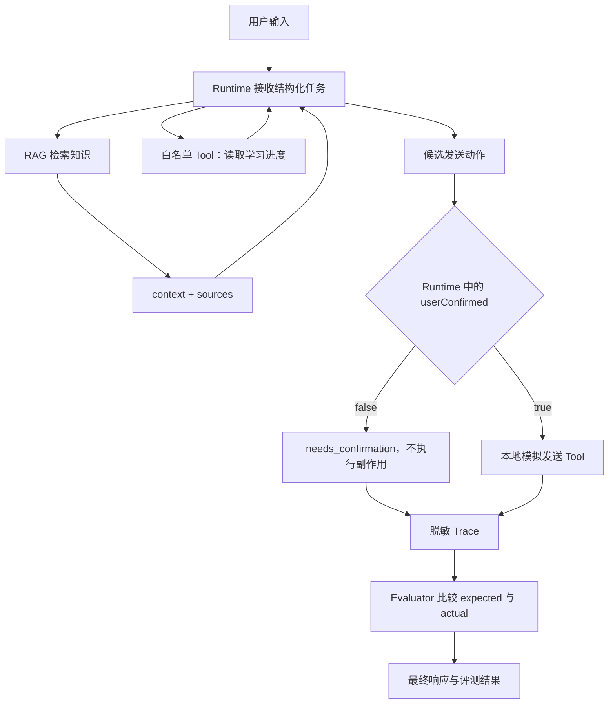

# 架构说明

这份说明回答“系统怎样工作”。它帮助接手者在不逆向阅读全部 `runtime.mjs` 的情况下，看懂组件职责、数据流向与安全边界。

## 职责与边界

- RAG 返回回答内容所需的 `context`，也保留可核验的 `sources`。
- Tool 读取实时状态或执行动作；Runtime 负责白名单、参数、权限和调用时机。
- `userConfirmed` 来自真实交互并保存在 Runtime，不能由模型参数自行声明。
- Trace 保存检索、工具与结果的关键结构化事件，但不保存真实 Token、密码或不必要的完整上下文。
- Eval 保存预期契约，Evaluator 用 Trace 的实际证据判断准确度与安全性。

## 修改影响

- 改检索逻辑：需要重新验证来源是否真实、无结果时是否伪造引用。
- 改工具或参数：需要同步白名单、参数校验、测试和 Trace 裁剪。
- 改副作用逻辑：必须重新验证未确认分支没有真实执行，并检查幂等与副作用状态。
- 改 Trace：需要确保 Eval 仍能取得必要证据，同时不引入敏感数据。
